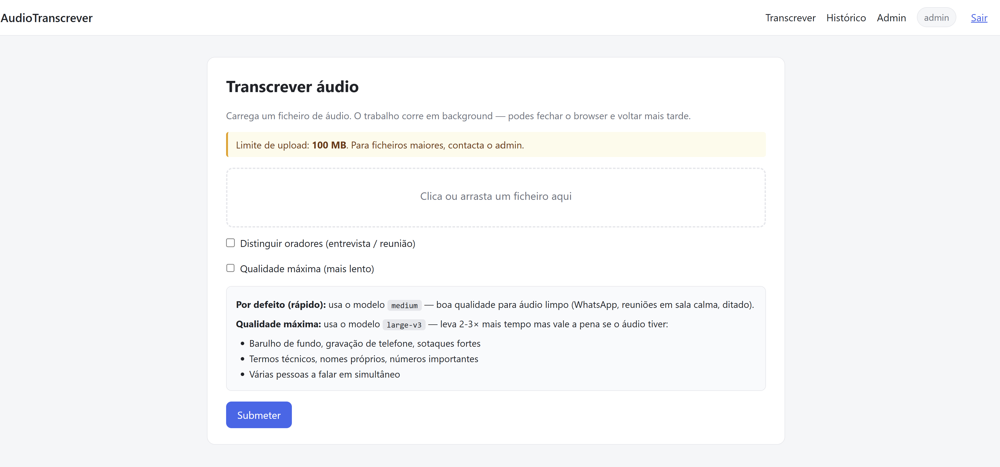
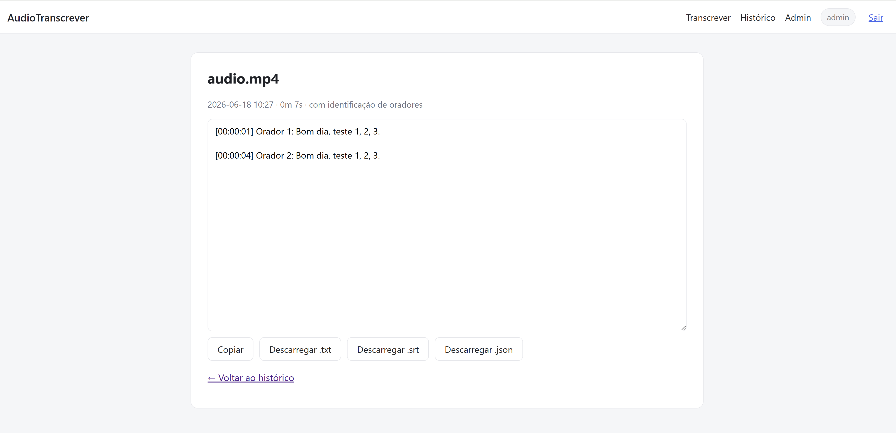
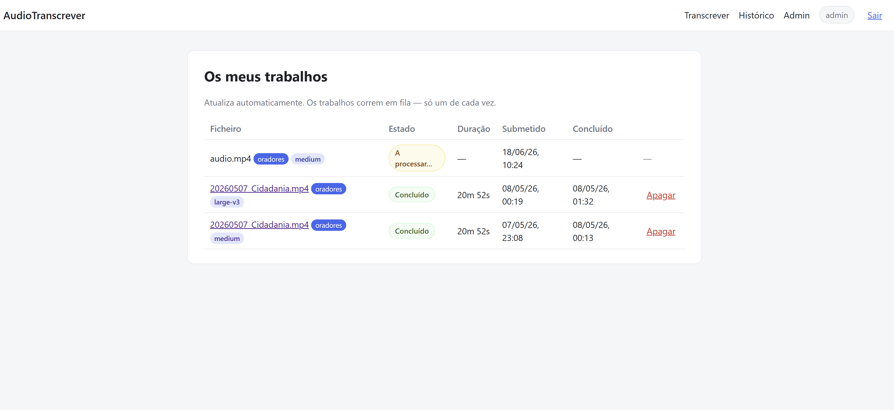
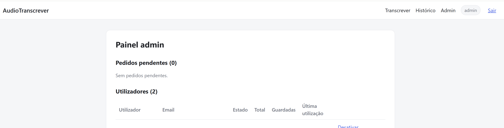

# AudioTranscrever

A self-hosted web application for **automatic audio and video transcription**, optimized for Portuguese. Upload a file, choose the transcription quality and optionally enable speaker separation, and download the result as `.txt`, `.srt`, or `.json`.

It runs entirely on your own machine or server (CPU-only, no GPU required) using Docker, and includes user accounts, an administration panel, and email notifications.

## Features

- **Audio and video transcription** powered by [WhisperX](https://github.com/m-bain/whisperX) (built on faster-whisper).
- **Two quality modes:** fast (the `medium` model) or maximum quality (`large-v3`).
- **Optional speaker diarization** that labels each speaker ("Speaker 1", "Speaker 2", ...) using [pyannote-audio](https://github.com/pyannote/pyannote-audio).
- **Multiple export formats:** plain text (`.txt`), subtitles (`.srt`), and structured data (`.json`).
- **User accounts** with login, access requests, and administrator approval.
- **Administration panel** to approve or reject requests, enable or disable accounts, and reset passwords.
- **Per-user transcription history.**
- **Optional email notifications** when a job finishes or an access request is approved.
- **Automatic cleanup** of temporary files and old jobs.
- **Asynchronous job queue** that processes one job at a time to avoid overloading the server.

## Tech Stack

**Backend / Web**

- [Python](https://www.python.org/) 3.12
- [FastAPI](https://fastapi.tiangolo.com/) and [Uvicorn](https://www.uvicorn.org/)
- [SQLAlchemy](https://www.sqlalchemy.org/) over [SQLite](https://www.sqlite.org/)
- [Jinja2](https://jinja.palletsprojects.com/) for HTML templating
- Session-based authentication (signed cookies) with `passlib` and `bcrypt`

**Transcription engine**

- [WhisperX](https://github.com/m-bain/whisperX) 3.4.2
- [faster-whisper](https://github.com/SYSTRAN/faster-whisper)
- [pyannote-audio](https://github.com/pyannote/pyannote-audio) for diarization
- [PyTorch](https://pytorch.org/) (CPU build)

**Infrastructure**

- [Docker](https://www.docker.com/) and Docker Compose

## Architecture

The application is split into two independent Docker services:

```
+----------------------+         HTTP          +---------------------------+
|   transcrever-app    |  ------------------->  |   transcrever-whisperx    |
|                      |                        |                           |
|  FastAPI + SQLite    |                        |  FastAPI + WhisperX       |
|  UI, accounts, queue |  <-------------------  |  faster-whisper, pyannote |
|  history, emails     |     transcription      |  (CPU, int8)              |
+----------------------+                        +---------------------------+
```

- **`app`** provides the web interface, authentication, database, job queue, and notifications. It forwards transcription requests to the WhisperX service over an internal HTTP call.
- **`whisperx`** is a dedicated service that loads the models and performs transcription and diarization. Isolating it allows CPU and memory limits to be tuned independently.

## Getting Started

**Prerequisites:** [Docker](https://docs.docker.com/get-docker/) and Docker Compose.

```bash
# 1. Clone the repository
git clone https://github.com/josemalves/AudioTranscrever.git
cd AudioTranscrever

# 2. Create the configuration file from the example
cp .env.example .env

# 3. Edit .env and fill in the secrets (see the Configuration section)
#    - SESSION_SECRET and ADMIN_PASSWORD are required
#    - HF_TOKEN is only needed if you want diarization

# 4. Start the application
docker compose up -d --build
```

The application is then available at `http://localhost:8082` (the port is configurable via `APP_PORT`).

On first startup, an administrator account is created automatically using the credentials defined in `.env`.

> On the first transcription, the Whisper models are downloaded (several GB) and cached locally in `hf-cache/`. Subsequent transcriptions start immediately.

## Configuration

The main settings live in `.env` (see [`.env.example`](.env.example) for the full list):

| Variable | Description |
|----------|-------------|
| `SESSION_SECRET` | Secret used to sign session cookies (generate with `openssl rand -hex 32`) |
| `ADMIN_USERNAME` / `ADMIN_PASSWORD` | Administrator account created on first startup |
| `WHISPER_MODEL` | Default Whisper model (`medium`, `large-v3`, ...) |
| `WHISPER_LANGUAGE` | Transcription language (`pt` by default) |
| `HF_TOKEN` | HuggingFace token, required **only** for diarization |
| `SMTP_*` | Email configuration for notifications (optional) |

## Screenshots

**Transcription page** — upload a file and choose quality and speaker separation.



**Result** — transcription with speaker labels and export buttons (`.txt`, `.srt`, `.json`).



**History** — per-user job list with status, duration, and timestamps.



**Administration panel** — manage access requests and user accounts.



## License

[MIT](LICENSE) (c) José Alves
